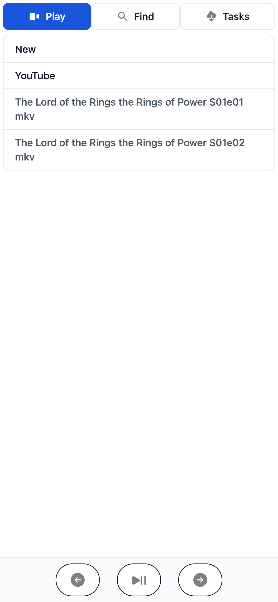
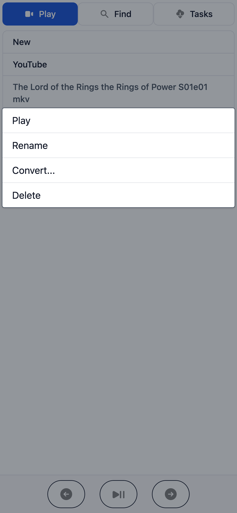
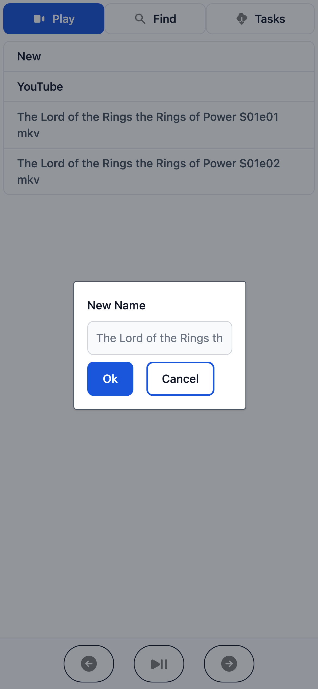
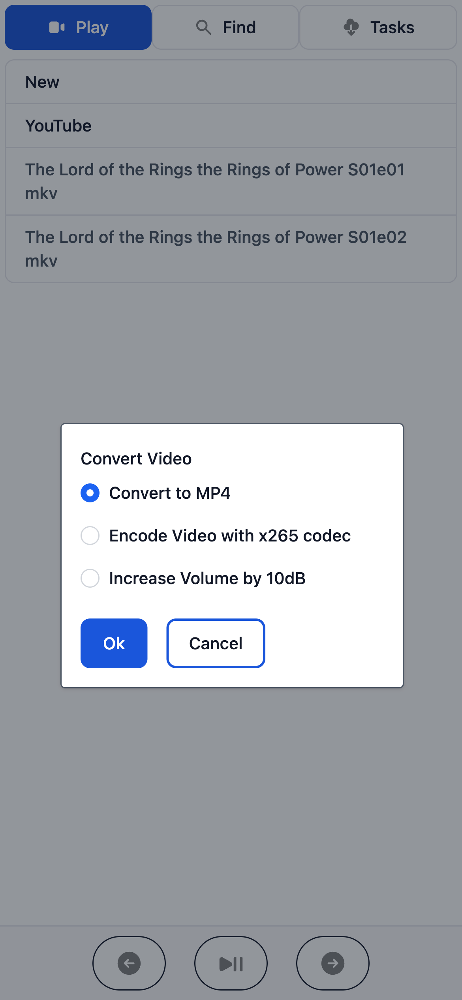
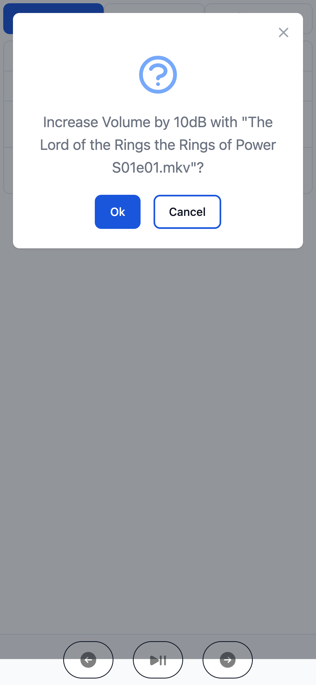
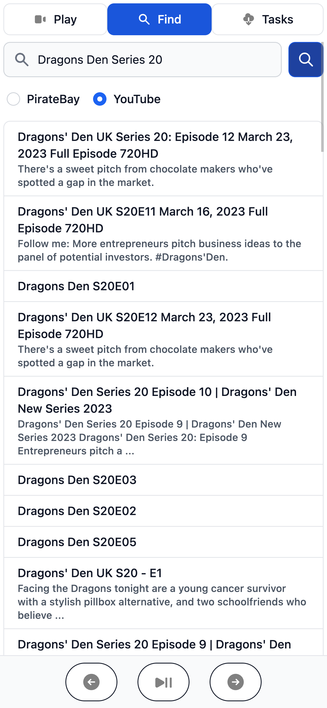
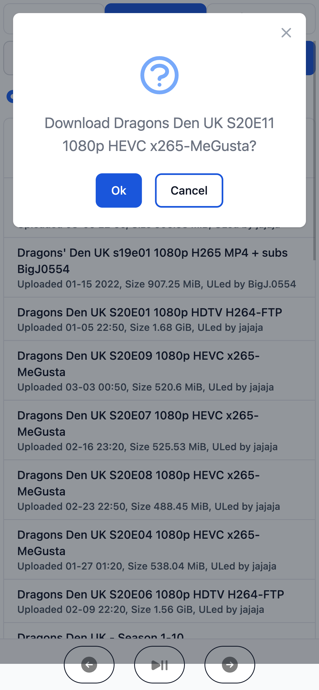
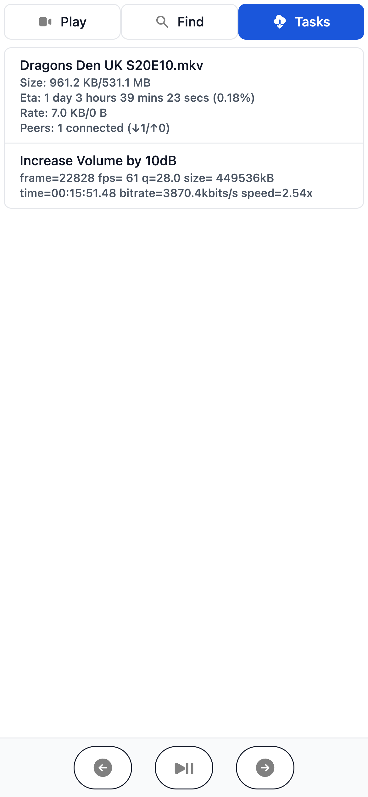

# TV Server

## Introduction

TV Server 
- provides ad free viewing of videos published on the public internet.
- connects Youtube to your TV and lets you control them with your mobile phone.
- is a thin wrapper around [FFmpeg](https://ffmpeg.org/), 
[yt-dlp](https://github.com/yt-dlp/yt-dlp) and [Transmission](https://transmissionbt.com/)

Architecturally, it consists of 3 components:

- The remote control, which is a web app that acts as a remote control
- The player, which is a web app that runs on the TV
- The server, which is a daemon that hosts the player and remote control apps and handles downloading 
and streaming movies; 


It has been tested on macOS and Debian Bullseye.

## Setup

The easiest way to get started is with docker compose. 

First you must create a file called `.env` in the root of the source directory that will contain
values for the required environment variables. There is a sample `.env` file called `env.sample`
that contains suitable values for running docker compose on macOS,  except for the `GOOGLE_KEY`, 
which you must supply yourself ([see below](#obtaining-a-google-api-key)).

```shell
$ cp env.sample .env
$ echo GOOGLE_KEY=YOUR_GOOGLE_KEY >> .env
$ export UID
$ docker compose up
```
NB YouTube search will not work until a key for the Google API is provided through the 
`GOOGLE_KEY` environment variable - ([see below](#obtaining-a-google-api-key)).

## Configuration

The tvserver daemon is configured through the following environment variables

| Environment Variable | Description                                                                        |
|----------------------|------------------------------------------------------------------------------------|
| GOOGLE_KEY           | *A key to use with the Google API, see below for instructions for obtaining a key. |
| MOVIE_DIR            | *The directory where movies will be stored.                                        |
| CLIENT_DIR           | The directory contain the client apps, defaults to `clients`                       |
| TRANSMISSION_URL     | URL to access the Transmission HTTP interface                                      |
| TRANSMISSION_USER    | Username to access the Transmission HTTP interface                                 |
| TRANSMISSION_PWD     | Password to access the Transmission HTTP interface                                 |
| TORRENT_DIR          | The directory where torrent files are saved.                                       |

`*` Required

## Obtaining a Google API Key

A Google account is required to create an API Key. Instructions for obtaining the key are
described here: https://support.google.com/googleapi/answer/6158862?hl=en

## Usage

Once the TV server daemon is up and running, load the Player page onto your TV with your TV browser 
by navigating to following page `http://hostname/player`, where `hostname` is the name of the 
computer running the TV server daemon.

Then, from your mobile phone's browser, navigate to `http://hostname` to load the remote control app.

## Clients

For simplicity, compiled versions of the apps are available in the `clients` directory.

The source for the clients is available as submodules that can be downloaded using
the following commands:

```shell
$ git submodule init
$ git submodule update
```

Any changes made to the clients can be compiled and copied to the `clients` directory by executing the
following in client source directory:

```shell
client_src/tvremote $ yarn run export
```

## VLC Player

VLC has support for a very broad range of video and audio codecs.
As a fallback, VLC can be used to play videos to a monitor to the server. 

## Remote Control

The remote control is a web app that runs in the browser of a mobile phone
and provides the following functionality:

### List of available videos

### Videos are organised into collections (folders).



### Clicking on a video brings up a menu of available options



### For instance the option to rename or move a video



### Or to create a new video by applying one of a list of available transformations 



The user is invited to confirm the conversion



### New Videos can be found by searching and downloading them from YouTube



Clicking brings up a dialog asking to confirm before downloading.



### The final tab provides a list of running tasks, e.g. downloads and conversions in progress.




